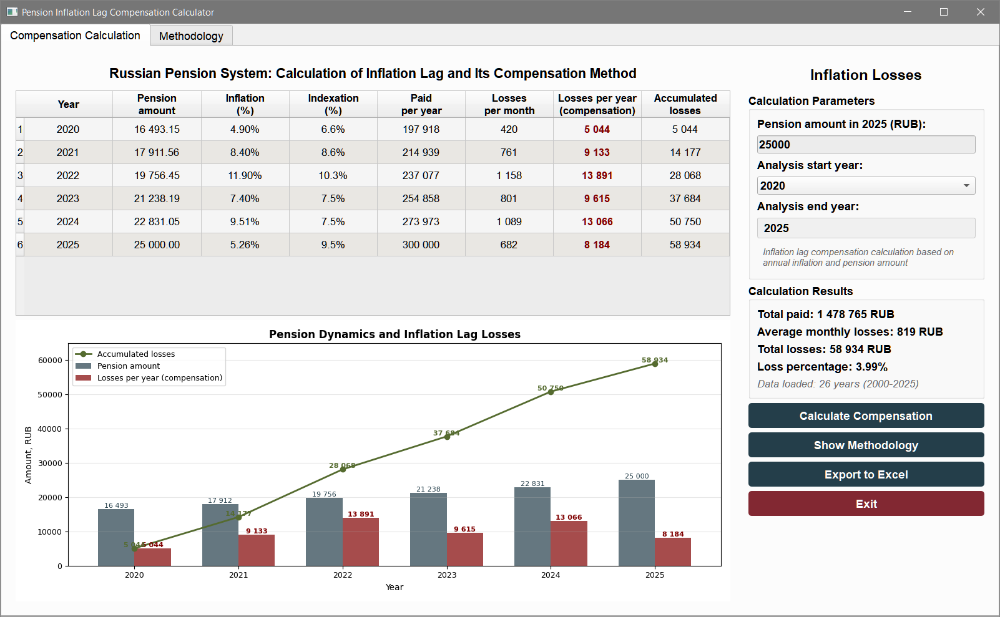

# Russian Pension System: Calculation of Inflation Lag and Its Compensation Method

## Overview
A Python application for calculating inflation lag in the Russian pension system and determining required compensation amounts.

## Features
- Mathematical calculation of inflation lag
- Interactive GUI with PyQt5
- Year-by-year analysis
- Visual charts
- Excel export

## Installation
1. Python 3.8 or higher
2. Install packages:
pip install pandas numpy matplotlib PyQt5 openpyxl xlrd

3. Clone repository:
```
git clone https://github.com/yourusername/pension-loss-calculator.git
cd pension-loss-calculator
```
4. Install dependencies:
```
pip install -r requirements.txt
```
5.  Ensure data file: `data/russia_inflation.xlsx`

### Adaptability to Other Countries

The program can be adapted to analyze pension systems of other countries by replacing the input data file while preserving the Excel structure.

**Steps to adapt:**

1. **Prepare your data file** `data/[country]_inflation.xlsx` with the following columns (case-sensitive):
   - `year` (integer, e.g., 2020)
   - `inflation_rosstat` (float, percentage, e.g., 7.42)
   - `indexation` (float, percentage, e.g., 8.6)

2. **Either:**
   - **Option A:** Rename your file to `data/russia_inflation.xlsx` (the default name expected by the program)
   - **Option B:** Modify line 688 in `main_window.py`:
     ```python
     # Change from:
     excel_path = os.path.join(base_path, 'data', 'russia_inflation.xlsx')
     
     # To (example):
     excel_path = os.path.join(base_path, 'data', 'germany_inflation.xlsx')
     ```

**Note:** The mathematical model, interface, and all functionalities remain identical—only the source data changes. The program will automatically adjust calculations and visualizations for the new dataset.
   
## Usage
Run application:
```
python main_window.py
```

## Application Interface

### Tab "Main Results"
**Calculation Parameters (right panel):**
- Pension amount in 2025 (RUB)
- Analysis start year (dropdown list)
- Analysis end year (fixed at 2025)

**Calculation Results:**
- Total paid
- Average monthly losses
- Total losses
- Loss percentage
- Payment in December

**Main Table (left panel):**
- Year
- Monthly losses (in December prices)
- Payment in December (in December prices)
- Cumulative payments (in December prices)

**Chart:**
- Pension amount dynamics
- Required compensation payments dynamics
- Cumulative payments

### Tab "Detailed Data"
**Detailed Table:**
- Year
- Pension in January
- Inflation (%)
- Indexation (%)
- Total paid
- Compensation in beginning-of-year prices
- Compensation in end-of-year prices
- Loss percentage (%)

**Chart:**
- Inflation and pension indexation dynamics

### Tab "Methodology"
**Detailed Calculation Description:**
- Main formulas
- Calculation examples
- Results interpretation
- "Update Methodology Calculation" button

### Functions:
- Compensation calculation ("Calculate Compensation" button)
- Export to Excel with professional formatting
- Automatic methodology update when switching tabs

## Methodology
Formula: `C_start = P × ∑[m=1 to 12] [1 - (1 + i)^(-m/12)]`

Payment in December (adjusted for inflation):
`C_end = C_start × (1 + i)`

Where:
- C_start = compensation in beginning-of-year prices (RUB)
- C_end = actual payment in end-of-year prices (RUB)  
- P = monthly pension in January (RUB)
- i = annual inflation rate (decimal)
- m = month number (1-12)

### Key Insight
Two compensation amounts are calculated:
1. **Nominal loss** (C_start) - purchasing power erosion measured at year start
2. **Actual payment** (C_end) - amount needed in December after annual inflation

## Screenshots

### Main Application Interface


*Main application window showing calculation results table and graphical analysis*

### Methodology Explanation


*Detailed methodology explanation with calculation verification*

## Project Structure
```
pension-loss-calculator/
├── main_window.py          # Main application module
├── data/                   # Data directory
│   └── russia_inflation.xlsx  # Rosstat inflation data
├── Screenshots/
│   ├── screenshot-main.png
│   └── screenshot-main_2.png
├── requirements.txt        # Python dependencies
├── README.md              # This file
├── LICENSE                # MIT License
└── .gitignore            # Git ignore rules
```

## Data Requirements
Excel file `data/russia_inflation.xlsx` with columns:
- year
- inflation_rosstat
- indexation

## License
[MIT License](LICENSE)

## Support

Open issue on GitHub repository.


